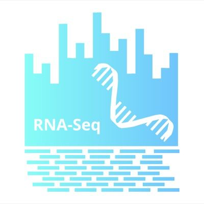

# **bioflows**

## **Summary**
This is a guide to using the `bioflows` package for running standard
pipelines to analyse NGS datasets. Currently, we have implemented some standard workflows alongwith tutorials using this package. To start using bioflows use the quick start to go to any of the tutorials implemented

## **Quickstart**
<div markdown="1" class="row" style="max-width: 100%;">
<div markdown="1" class="md-flex__cell md-flex__cell--shrink" style="display: flex; width: 100%;">

!!! rna "RNA Seq with GSNAP"
    [{:style="width: 100px; float: none; margin-left: 7px; margin-top: 7px;"}](tutorials/rna-seq_tutorial.md) RNA-Seq on CCV

!!! warning "QIIME2"
    [{:style="width: 100px;float: left ;margin-left: 7px;margin-top: 7px;"}](tutorials/qiime2_tutorial.md) QIIME2 on CCV
    
!!! info "GATK GERMLINE"
    [{:style="width: 100px;float: left ;margin-left: 7px;margin-top: 7px;"}]() Variant Calling on CCV

!!! example "GATK SOMATIC"
    [{:style="width: 100px;float: left ;margin-left: 7px;margin-top: 7px;"}]() Somatic variant Calling on CCV
  
</div>
</div>

## **Motivation**
A primary objective of the [Computational Biology Core](https://cbc.brown.edu) at Brown's [Centre for Computational Biology of Human Disease](https://www.brown.edu/research/projects/computational-biology-of-human-disease/home), is to enable reproducibility in computational analysis of NGS data. Critical to this objective is to provide a simple tool for creating/running bioinformatics workflows as well as consistent software environments across multiple platforms. To this we:

- Developed **bioflows** a workflow tool to ensure consistency in analysis steps and stages with interoperability across multiple job submission systems
- **Use [CONDA](https://conda.io/docs/)** package management system for managing software tools
- Container based approach using **[docker](https://www.docker.com)** for cross-platform interoperability of the analysis environment

## **Overview**
**bioflows** is an user-friendly python implementation of a workflow manager. The user is expected to not have any programming knowledge and needs to only provide a control file in a YAML format, chosen for its human readability. The goal here is to provide users with a simple and straight-forward interface for processing NGS datasets with many samples using standard bioinformatics pipelines, e.g  RNA-seq, GATK variant calling etc. The tool is developed to alleviate some of the primary issues with scaling up pipelines, such as file naming, management of data, output and logs. 

## **How it works**
 **bioflows**  uses two main python packages: 1)  **[luigi](https://luigi.readthedocs.io/en/stable/)** developed at **spotify**  for managing dependencies among task and 2) **SAGA** python API to launch jobs across different types of systems. All the necessary tools are provided from the **[CBCs anaconda channel](https://anaconda.org/compbiocore/dashboard). 

## **Key Features**
Currently **bioflows** provides the following features:

- Simple management of
    1. data
    2. logs
    3. results
    4. scripts
        
- A module to easily download data from NCBI's SRA archive and to optionally directly continue processing the data through the pipelines. A few key elements of this module are:
    - Only download and convert the data to usable fastqs
    - Data from multiple runs are concatenated automatically
    - Metadata associated with the SRA data is also provided as a seperate table
        
- Conda packages for all dependencies are already pre-built and provided alongwith the software

## Conda Package Management
`CONDA` is a system agnostic software package management system based on
the Anaconda python distribution to ensure that a software and all its
dependencies are bundled together. These conda packages can be
downloaded from various publicly available repositories called
*channels* and one such channel for bio-informatics tools is bioconda.

For ensuring reproducibily, we have established a publicly accessible channel for all programs that are included with wrappers within the `bioflows` tool through the [**compbiocore channel**](https://anaconda.org/compbiocore/). In this channel, we have also provided conda packages of all software used including the `bioflows` package itself. To download specific packages or the `bioflows` tool use the following command into your conda environment:

```
    conda install -c compbiocore /pkg_name/
```
!!! note
    `bioflows` and its dependencies are available as `conda` packages for the linux OS only. 
    To use `bioflows` in other OSes you will need to use the docker container approach
    
More detailed instructions on how to install anaconda and use the conda
environments can be found in the anaconda documentation for:

-   [Installation](https://docs.anaconda.com/anaconda/install.html)
-   [Getting started](https://docs.anaconda.com/anaconda/user-guide/getting-started.html)

